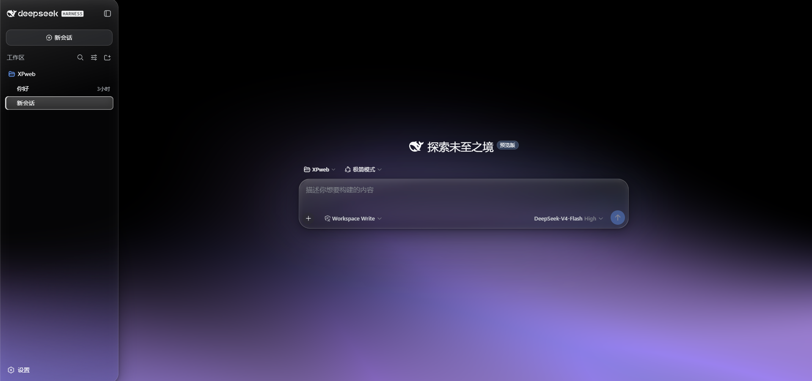
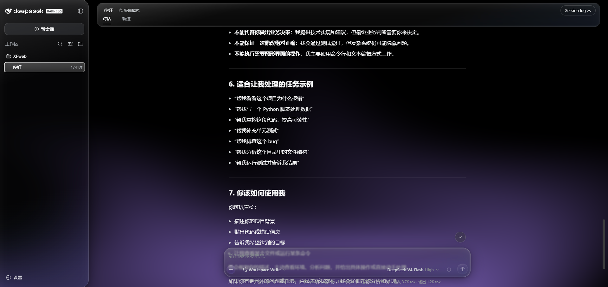
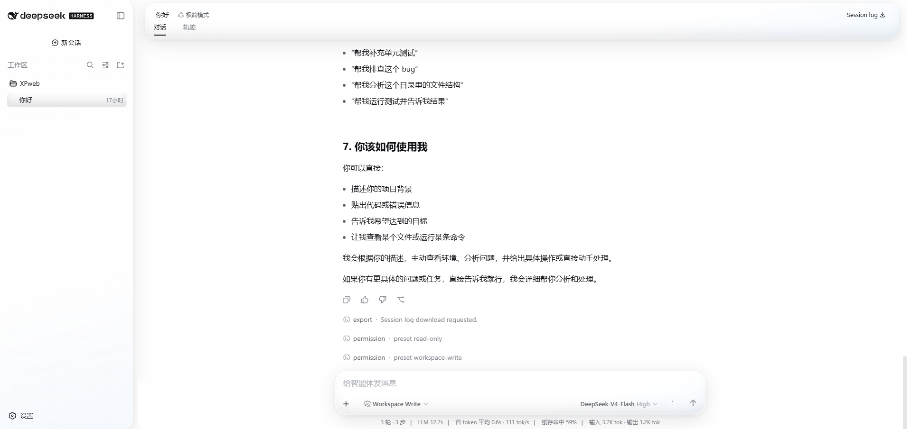
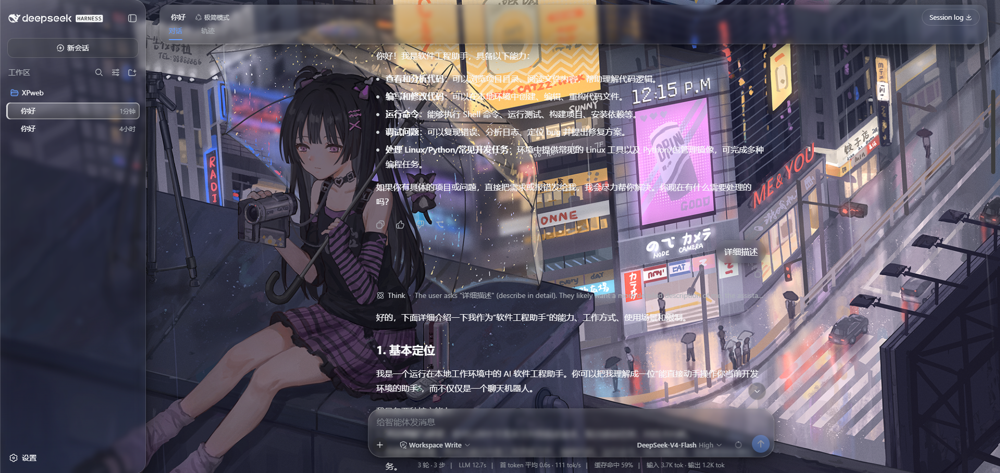
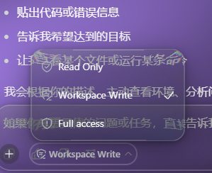
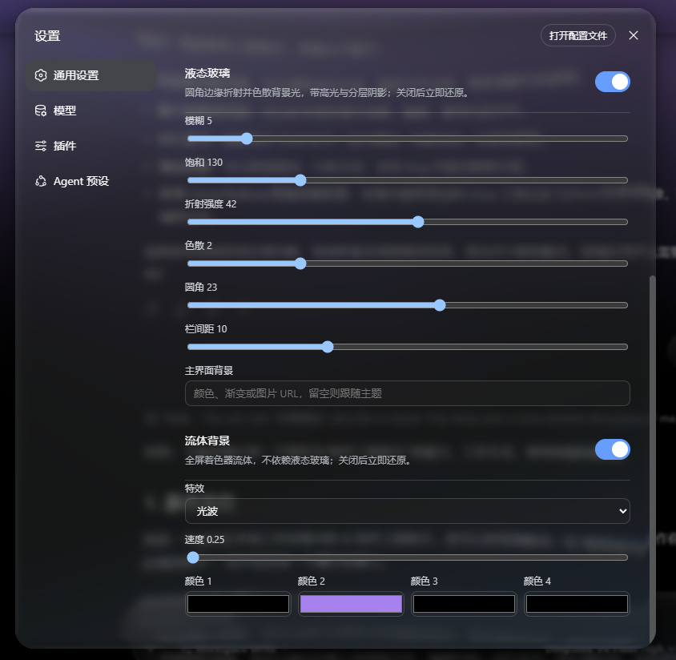
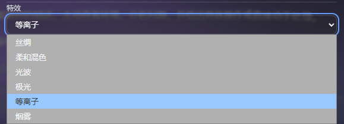
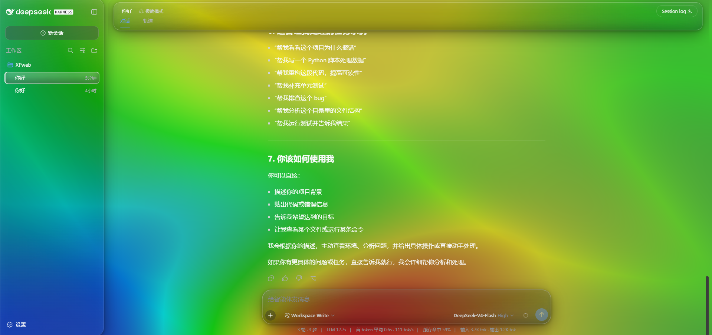

# dsh-liquid-glass-fluid-background

[English](README.md) | 中文

可安装的 DeepSeek Harness **组合包**，作用于 Web GUI：可选 iOS 风格液态玻璃，以及不依赖玻璃开关的 Isolation 流体背景。

本目录已是可上传的插件 checkout。`lib/` 已经打好。安装入口不是 `src/`。



## 效果

对话页（深色、玻璃开、流体壁纸）：



浅色模式沿用同一套叠加层：



流体关闭时，可用静态 `http(s)` 图片作画布：



菜单铬层会透过玻璃边缘折射背后画面：



## 安装

需要已安装的 `dsh` CLI 和 **web** profile。

在本目录执行：

```sh
dsh plugin --profile web add .
```

或安装本目录里的 tarball：

```sh
dsh plugin --profile web add ./dsh-liquid-glass-fluid-background-0.1.0.tgz
```

然后启动 Web：

```sh
dsh --profile web
```

打开 **设置 → 通用**。打开「液态玻璃」和／或「流体背景」。流体不依赖液态玻璃；两者都开时流体是壁纸。



流体预设（丝绸、柔和混色、光波、极光、等离子、烟雾）：



四种自定义颜色会改写 Isolation 色场：



## 卸载

```sh
dsh plugin --profile web remove dsh-liquid-glass-fluid-background
```

## 内容

- Host 半：设置命名空间 `ui-theme-liquid-glass`（玻璃参数 + 流体开关），以及在客户端树绘制前写入 `data-dsh-liquid-glass` 的 tapIndex 引导。
- 浏览器半：token 叠加层、霜化样式、SVG 透镜，以及 Isolation WebGL（或 CSS 渐变）画布。

`@deepseek-ai/dsh-*` 由 web profile 提供，本组合包不重新发布它们。
